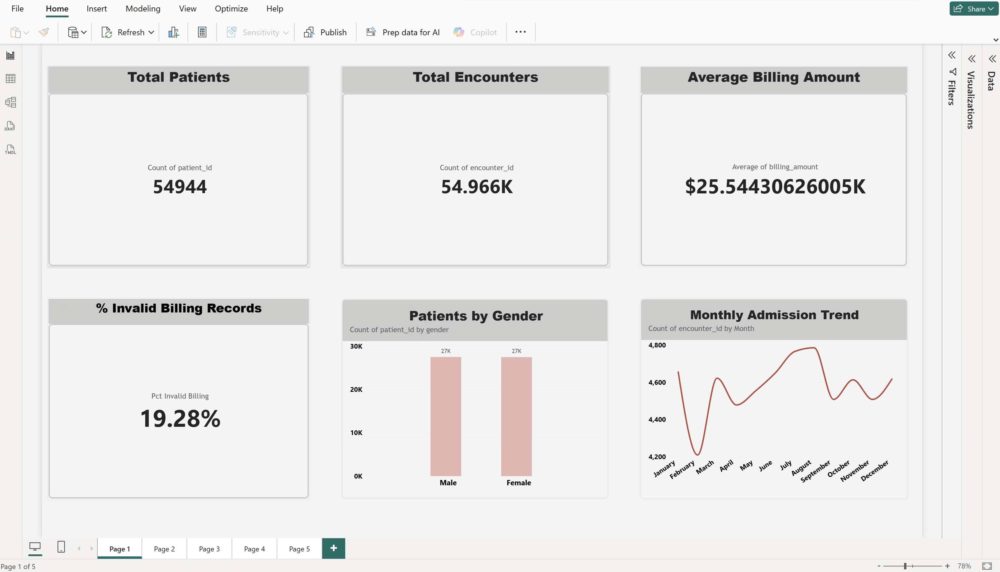
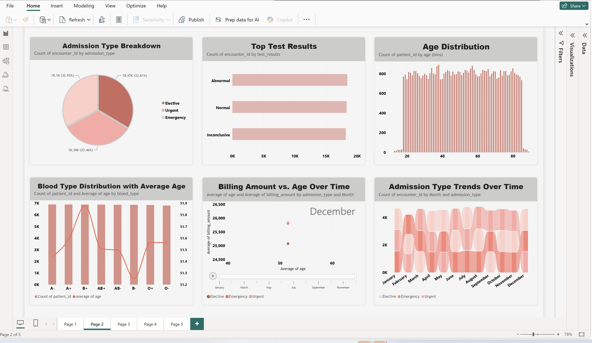
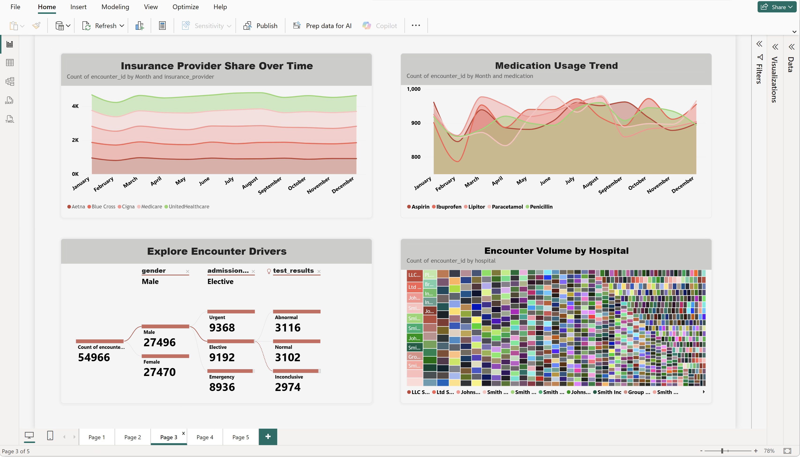
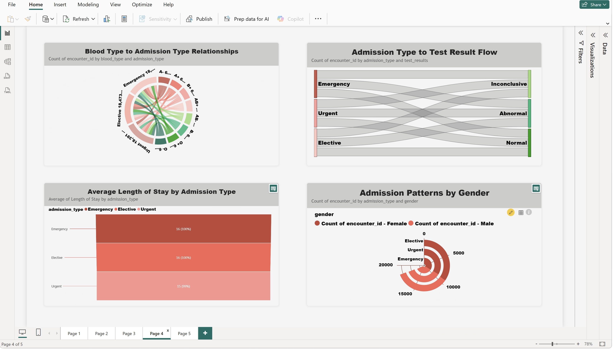
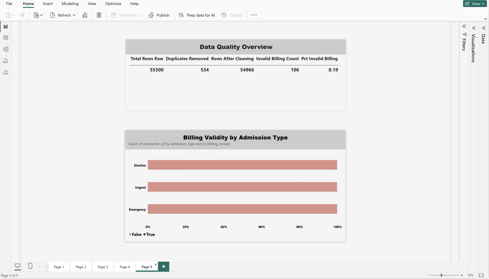

# Healthcare Data Analytics & Quality Monitoring Platform

An end-to-end data analytics project that takes a raw, messy healthcare dataset (~55K records) through profiling, cleaning, relational database design, SQL analysis, and interactive Power BI reporting — built to mirror the kind of data support and BI work described in data/AI analyst internship roles (SQL, data profiling, schema interpretation, Power BI, and project documentation).

🎥 **[Watch the full dashboard walkthrough on LinkedIn](https://www.linkedin.com/posts/fatema-alam-074496249_dataanalytics-powerbi-sql-activity-7507659674570182657-da-_?utm_source=share&utm_medium=member_desktop&rcm=ACoAAD15QdgBxfVk9JBvFSBHeNauhxxXK_SoxO8)**

[](powerbi/dashboard_screenshots/page1-overview.png)

---

## Table of Contents
- [Project Overview](#project-overview)
- [Architecture](#architecture)
- [Tech Stack](#tech-stack)
- [Data Profiling & Cleaning](#data-profiling--cleaning)
- [Database Schema](#database-schema)
- [SQL Work](#sql-work)
- [Power BI Dashboard](#power-bi-dashboard)
- [Screenshots](#screenshots)
- [User Stories & Acceptance Criteria](#user-stories--acceptance-criteria)
- [Limitations](#limitations)
- [Future Work](#future-work)
- [Repository Structure](#repository-structure)
- [How to Reproduce This Project](#how-to-reproduce-this-project)

---

## Project Overview

Public healthcare datasets are rarely analysis-ready. This project simulates a realistic data support workflow: take a raw CSV export, investigate its quality, build a proper relational structure around it, write SQL that answers real operational questions, and deliver the results as a decision-ready BI report — while documenting every judgment call along the way.

**Goals:**
- Practice real SQL (joins, CTEs, window functions, aggregations, data validation queries) against a non-trivial dataset
- Demonstrate a documented data-profiling and cleaning process, not just a finished chart
- Build a multi-page, interactive Power BI report with a genuine variety of visual types
- Produce the kind of paper trail (schema docs, findings, requirements) that a team could actually hand off to someone else

**Dataset:** [Healthcare Dataset by prasad22 (Kaggle)](https://www.kaggle.com/datasets/prasad22/healthcare-dataset) — ~55,500 synthetic patient admission records.

---

## Architecture

```
                    ┌─────────────────────┐
                    │   Kaggle CSV file    │
                    │  (raw, single table) │
                    └──────────┬──────────┘
                               │
                               ▼
                    ┌─────────────────────┐
                    │   Google Colab       │
                    │  (Python / pandas)   │
                    │  - profiling         │
                    │  - cleaning          │
                    │  - schema split      │
                    └──────────┬──────────┘
                               │  SQLAlchemy
                               ▼
                    ┌─────────────────────┐
                    │  PostgreSQL          │
                    │  (Supabase, hosted)  │
                    │  patients ─┬─ encounters │
                    └──────────┬──────────┘
                               │
                  ┌────────────┼────────────┐
                  ▼                         ▼
        ┌──────────────────┐     ┌──────────────────────┐
        │  Supabase SQL     │     │  Power BI             │
        │  Editor           │     │  (imported via CSV    │
        │  (analytical +    │     │   export, modeled     │
        │   validation      │     │   relationships,      │
        │   queries)        │     │   20 visuals across   │
        └──────────────────┘     │   5 report pages)      │
                                  └──────────────────────┘
```

**Why this stack:** Supabase gives a real, managed PostgreSQL instance (no local install required), which mirrors how companies actually host production databases (AWS RDS, Cloud SQL, etc.) rather than running Postgres on a personal laptop. Power BI connects to real cleaned data with an explicit, auditable relationship model rather than one flat spreadsheet.

---

## Tech Stack

| Layer | Tool | Purpose |
|---|---|---|
| Data source | Kaggle (CSV) | Raw dataset |
| Data profiling & cleaning | Python (pandas), Google Colab | Null/duplicate/outlier detection, cleaning, schema split |
| Database | PostgreSQL (hosted on Supabase) | Relational storage, constraints, referential integrity |
| SQL | Supabase SQL Editor | Analytical queries, data validation queries |
| BI / Reporting | Power BI Desktop & Power BI Service | Data modeling, DAX measures, interactive visuals |
| Version control | Git / GitHub | Documentation and code history |

---

## Data Profiling & Cleaning

Profiling was done first, in Python, before any table was created — the goal was to understand what was actually wrong with the data before deciding how to fix it.

**Findings (documented as they were discovered):**

| Check | Result | Decision |
|---|---|---|
| Total raw rows | 55,500 | — |
| Missing values (all columns) | 0 | No imputation needed |
| Exact duplicate rows | 534 | Dropped |
| Negative `Billing Amount` | 108 rows | **Flagged**, not dropped — a boolean `is_billing_invalid` column was added instead of deleting rows, since a negative charge could plausibly represent a refund/credit and dropping it without domain context would silently distort billing analysis |
| Invalid `Age` (<0 or >120) | 0 | No action needed |
| Invalid dates (discharge before admission) | 0 | No action needed |
| Name casing | Inconsistent (e.g. `ashLEy ERIcKSoN`) | Normalized with title casing |
| Unique patient identifier | None present in source data | A surrogate `patient_id` was derived from `(Name, Age, Gender, Blood Type)` — documented as a limitation (see below) |

**Rows after cleaning:** 54,966 (534 duplicates removed).
**Unique patients identified:** 54,944 (22 patients share an identical demographic fingerprint with more than one encounter — see Limitations).

Full profiling notes: [`docs/data_profiling_report.md`](docs/data_profiling_report.md)

---

## Database Schema

The cleaned data was split from one flat file into two related tables to allow real joins, rather than working off a single denormalized CSV.

```sql
CREATE TABLE patients (
    patient_id INTEGER PRIMARY KEY,
    name VARCHAR(200),
    age INTEGER,
    gender VARCHAR(50),
    blood_type VARCHAR(10)
);

CREATE TABLE encounters (
    encounter_id INTEGER PRIMARY KEY,
    patient_id INTEGER REFERENCES patients(patient_id),
    doctor VARCHAR(100),
    hospital VARCHAR(200),
    insurance_provider VARCHAR(200),
    billing_amount DECIMAL(10,2),
    is_billing_invalid BOOLEAN,
    room_number INTEGER,
    admission_type VARCHAR(50),
    date_of_admission DATE,
    discharge_date DATE,
    medication VARCHAR(100),
    test_results VARCHAR(100)
);
```

`patients` (1) → `encounters` (many), enforced with a foreign key. Full schema notes: [`sql/schema.sql`](sql/schema.sql).

---

## SQL Work

All queries were written and tested directly against the live PostgreSQL database (not simulated). Highlights:

- **JOINs** — patient demographics joined to encounter details
- **GROUP BY / aggregations** — patient counts by gender, average billing by admission type
- **CTEs** — hospital-level billing aggregation with a minimum-volume filter
- **Window functions** — running monthly total of admissions
- **Data validation queries** — null counts, duplicate detection, referential integrity checks, invalid-value detection

Full query set with comments: [`sql/analytical_queries.sql`](sql/analytical_queries.sql) and [`sql/data_quality_checks.sql`](sql/data_quality_checks.sql).

One real finding from this stage: a query aggregating encounters per hospital with a 50+ encounter threshold returned **zero rows**, because hospital names in this dataset are close to unique per encounter rather than representing a small set of real institutions. The threshold was lowered to 3+ and the finding was documented rather than silently discarded — an example of the kind of "investigate, don't assume" step the profiling process was meant to practice.

---

## Power BI Dashboard

A 5-page interactive report was built on top of the cleaned, related tables.

| Page | Contents |
|---|---|
| 1 — Overview | Total Patients, Total Encounters, Average Billing Amount, % Invalid Billing (KPI cards), Patients by Gender, Monthly Admission Trend |
| 2 — Demographics & Trends | Admission Type Breakdown (donut), Top Test Results, Age Distribution, Blood Type Distribution with Average Age (combo chart), Billing Amount vs. Age Over Time (animated scatter, play axis), Admission Type Trends Over Time (ribbon chart) |
| 3 — Volume & Drivers | Insurance Provider Share Over Time (stacked area), Medication Usage Trend (area chart), Explore Encounter Drivers (decomposition tree), Encounter Volume by Hospital (treemap) |
| 4 — Relationships | Blood Type to Admission Type Relationships (chord diagram), Admission Type to Test Result Flow (Sankey), Average Length of Stay by Admission Type (funnel), Admission Patterns by Gender (radar) |
| 5 — Data Quality | Data Quality Overview (live DAX-measure summary table), Billing Validity by Admission Type (100% stacked bar) |

**Notable DAX measure:**
```dax
Pct Invalid Billing =
DIVIDE(
    COUNTROWS(FILTER(encounters, encounters[is_billing_invalid] = TRUE)),
    COUNTROWS(encounters)
) * 100
```

---

## Screenshots

*Click any image to view it full-size.*

### Page 1 — Overview
[](powerbi/dashboard_screenshots/page1-overview.png)

### Page 2 — Demographics & Trends
[](powerbi/dashboard_screenshots/page2-demographics-trends.png)

### Page 3 — Volume & Drivers
[](powerbi/dashboard_screenshots/page3-volume-drivers.png)

### Page 4 — Relationships
[](powerbi/dashboard_screenshots/page4-relationships.png)

### Page 5 — Data Quality
[](powerbi/dashboard_screenshots/page5-data-quality.png)

---

## User Stories & Acceptance Criteria

**User Story 1**
> As a healthcare data analyst, I want to filter encounter trends by month so that I can investigate changes in healthcare utilization over the year.

*Acceptance criteria:*
- The report displays encounter volume broken down by month.
- Visuals respond to cross-filtering when a data point is selected.
- The trend is legible without needing to open a separate table.

**User Story 2**
> As a data analyst, I want to review data-quality indicators alongside the operational metrics so that I can judge how much to trust the numbers I'm reporting on.

*Acceptance criteria:*
- A dedicated page shows total rows, duplicates removed, and invalid-record counts.
- Invalid billing records are visible broken down by admission type, not just as a single aggregate number.
- Data-quality figures are documented with the reasoning behind each cleaning decision, not just the resulting numbers.

**User Story 3**
> As a stakeholder comparing patient groups, I want to see how billing and demographics interact over time so that I can spot patterns that a single static chart would hide.

*Acceptance criteria:*
- At least one visual supports animation/playback across a time dimension.
- Legends allow isolating a single category (e.g. one admission type) without editing the report.

Full requirements doc: [`docs/requirements.md`](docs/requirements.md)

---

## Limitations

Being upfront about these was treated as part of the deliverable, not an afterthought:

- **No true unique patient identifier in the source data.** `patient_id` was derived from name + age + gender + blood type. 22 rows share an identical fingerprint with more than one encounter — this is either a genuine repeat patient or a coincidental demographic match, and the dataset gives no way to tell which.
- **Hospital and doctor fields are near-unique per row**, which is realistic-looking but limits any "top hospitals" style analysis — the treemap and any hospital-level aggregation should be read as illustrative of technique rather than a real operational insight.
- **Negative billing amounts (108 rows) were flagged, not explained.** Without access to the original billing system, it isn't possible to confirm whether these are refunds, data entry errors, or something else.
- **The dataset is synthetic**, generated for demonstration purposes — it should not be described or presented as real patient data.
- **`Total Rows Raw` and `Duplicates Removed` in the Data Quality page are static values** reflecting the one-time cleaning pass, not a live recalculation, since the original uncleaned data is intentionally not kept in the production tables.

---

## Future Work

- Automate the ingestion pipeline (Python cleaning → Postgres load) with Airflow instead of a manual Colab run, so the dataset can refresh on a schedule
- Add row-level lineage so a viewer can trace a dashboard number back to the specific source rows that produced it
- Extend the schema with `hospitals` and `doctors` dimension tables if a future dataset has realistic (non-unique) values for these fields
- Add automated data-quality tests (e.g. with `dbt` tests or Great Expectations) that run on every load rather than being profiled manually once
- Publish the report to Power BI Service with scheduled refresh once the data source supports a stable live connection

---

## Repository Structure

```
healthcare-analytics-platform/
│
├── README.md
├── .gitignore
│
├── notebooks/
│   └── data_profiling_and_cleaning.ipynb      # Colab notebook: profiling, cleaning, schema split, load
│
├── sql/
│   ├── schema.sql                              # CREATE TABLE statements + design notes
│   ├── data_quality_checks.sql                 # Null/duplicate/invalid-value validation queries
│   └── analytical_queries.sql                  # JOINs, CTEs, window functions, aggregations
│
├── docs/
│   ├── requirements.md                         # User stories + acceptance criteria
│   ├── schema.md                                # Table/column descriptions, relationship diagram
│   ├── data_profiling_report.md                # Findings from the profiling stage, in narrative form
│   └── data_dictionary.md                       # Column-by-column definitions for both tables
│
├── powerbi/
│   ├── healthcare-analytics-dashboard.pbix     # The Power BI file itself
│   └── dashboard_screenshots/                  # PNG exports of all 5 report pages
│
└── data/
    └── README.md                                # Where to obtain the source dataset (not committed directly)
```

**Do not commit the raw or cleaned CSV/data files themselves** if the source has any redistribution restrictions — `data/README.md` should instead explain where to download the original Kaggle dataset and how to regenerate the cleaned version by running the notebook.

---

## How to Reproduce This Project

1. Download the [source dataset](https://www.kaggle.com/datasets/prasad22/healthcare-dataset) from Kaggle.
2. Open `notebooks/data_profiling_and_cleaning.ipynb` in Google Colab, upload the CSV, and run all cells to reproduce the profiling, cleaning, and schema split.
3. Create a free [Supabase](https://supabase.com) project and grab its PostgreSQL (Session Pooler) connection string.
4. Update the connection string in the notebook and run the load cells to populate `patients` and `encounters`.
5. Run `sql/schema.sql` and the queries in `sql/` directly in the Supabase SQL Editor to verify the tables and relationships.
6. Open `powerbi/healthcare-analytics-dashboard.pbix` in Power BI Desktop (or import the two tables as CSV exports if connecting live to Postgres isn't available in your environment) to explore or extend the report.

---

*Built as a self-directed project to practice the SQL, data profiling, and BI skills described in data & AI analyst internship postings.*